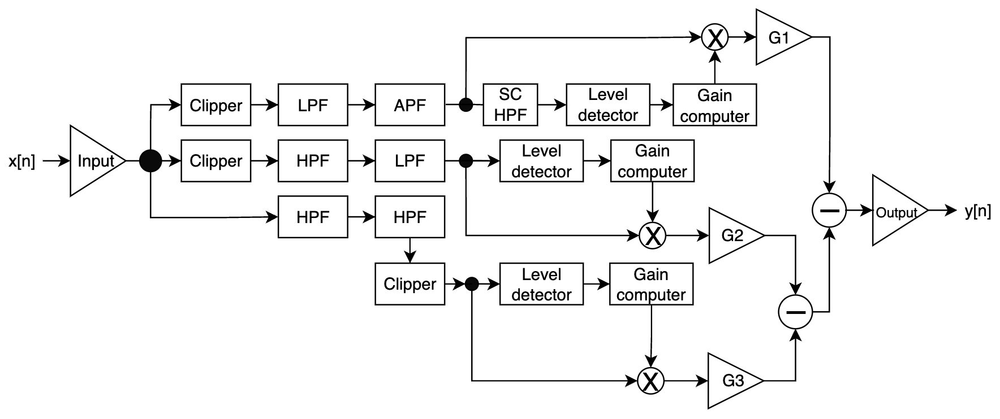

# Mugi Dynamics 4216 UpDown Multi-band Compressor

This is a WIP multi-band compressor plugin built in JUCE with original DSP and 3D graphics.

# 3 bands. 2 directions. 1 compressor.

The interface is inspired by vintage racing aesthetics and centred around the gauge cluster-style gain reduction meters. Each band has its own colour-coded needle to provide intuitive metering at a glance.

# Signal flow.

Linkwitz-Riley filters separate the bands before they're fed into their respective detectors and GCs.

Each compressor section has a combination of a fast detector and slow detector running in parallel. The blending of these two signals gives the overall compression characteristic.

In upwards compression mode, an additional downwards compressor is placed in serial to prevent runaway gain instability. This overcompression feature provides additional shaping characteristics when pushed hard.

# WIP feature roadmap

- UI: Preset manager
- UI: Advanced controls (internal headroom, compression behaviour, stereo link)
- UI: Waveform-style gain reduction graphics section
- DSP: More advanced saturation algorithm
- DSP: Anti-aliasing filters
- DSP: Steep crossover filters DSP option